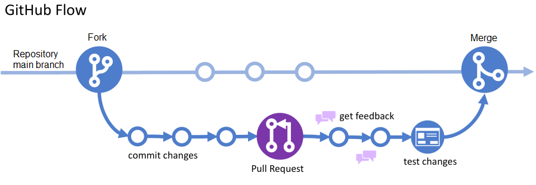
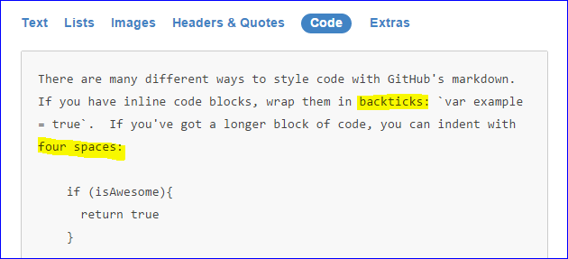
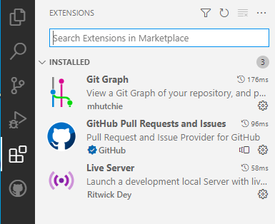

## GitHub Kılavuzu

GitHub kullanmak için üç önemli sebep:
* Projeniz bir bütün olarak bulutta, her yerden erişilebilir
* Otomatik sürüm kontrolü ve koordineli takım çalışması 
* Programcılar için özgeçmişin önemli bir parçası

### Commit, Branch, Pull Request, Merge

Yerel bilgisayarda denemeleri yapıp çalışır duruma getirince `Commit` işlemini yapıyoruz. Dokümanlardaki "Kaydet" gibi bir işlem, tek farkı, bütün ayrıntılar kaydedildiği için eski bir duruma dönmek mümkün. `Commit` işlemlerinin çok sayıda olmasında korkmayın: Her Commit, programın bir tek özelliğini değiştirmeli.

* Save: Yerel dosyayı değiştir, repoya dokunma
* Commit: Dosyaların son halini yerel repoya ekle
* Push: Yerel reponun son halini buluta kopyala

Yeni bir özellik denemek ya da takım çalışması yapmak için dallanma gerekiyor. Her dalı ayrı bir proje olarak düşünebiliriz. Desktop programında dal değiştirince, klasördeki dosyalar da uygun bir şekilde değişiyor, sadece o dala ait dosyalar görünüyor. Programın ana dalına `main` adı verilmiş. 

Bir dal üstünde yeteri kadar çalışıp doğru işlediği görülünce, o dalın sahibi `Pull Request` yapıyor, projenin sahibi ya `Merge` ile yeni özellikleri programa ekliyor, ya da dalı silerek reddediyor. 

### Markdown (MD) formatı

Karmaşık HTML sayfalarını basitleştiren [MD formatını](https://guides.github.com/features/mastering-markdown/#examples) on dakikada öğrenmek ister misiniz? GitHub'da bu formatı kullanmak şart değil ama bunun gibi sayfaları düz metin gibi kolayca yazabilirsiniz.

Markdown denemeleriniz için VS Code içinde Preview yeterli.

### VS Code Extensions

GitHub ile uygun çalışması için şu eklentiler gerekiyor:
* Git Graph -- Commit'leri görmek ve reset
* GitHub Pull Requests and Issues -- login
* Live Server -- Uzak bilgiye erişim (fetch)

### Git Command Line (CLI)

VS Code öncesinde, bu adımları *Command line* içinde yerel klasör altında `git` komutu ile yapmak gerekiyordu. VS Code menüsündeki her işleme karşı gelen `git` komutu ile kıyaslayınca sürecin ne kadar basitleştiğini görebilirsiniz:
* `Stage all` ⇒ `git add *` 
* `Commit` ⇒ `git commit -m "mesaj... bişeyler"`
* `Remote` ⇒ `git remote add origin https://blm305.github.io/2021/`
* `Push` ⇒ `git push origin main`

Git için [kapsamlı bir kitap](https://git-scm.com/book/en/v2) var ama VS Code yazılımı normal bir kullanıcının çoğu ihtiyacını karşılıyor. 
"Merge conflict" ya da "merge revert" durumlarında biraz Git bilmek gerekecektir.

### Referanslar

* Pronunciation: [forvo.com/word/github](https://forvo.com/word/github)
* Documents: [guides.github.com](https://guides.github.com)
* [git-version-control-workflow](https://build5nines.com/introduction-to-git-version-control-workflow)

### Teşekkürler

* [Gürsu Gülcü](https://github.com/gulcu) 
* [Hakan DILEK](https://github.com/hakandilek)
* [Ayla Gülcü](https://github.com/aylagulcu)
* [Güngör Yılmaz](https://github.com/gungor)
 
Eski öğrencilerim bu konuda bana öğretmen oldular :)

