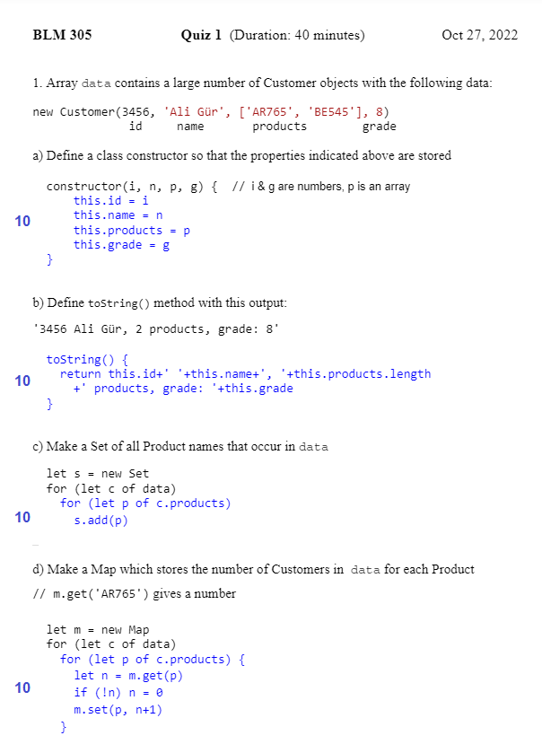
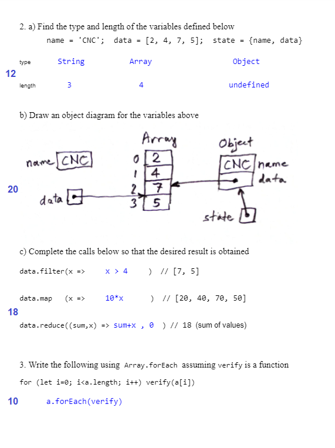


## Quiz#1 -- 2022

```javascript
class Customer {
  constructor(i, n, p, g) {
	this.id = i; this.products = p
	this.name = n; this.grade = g
  }
  toString() {
    return this.id+' '+this.name+', '
        +this.products.length+' products, '
        +'grade: '+this.grade
  }
}
new Customer(3456, 'Ali Gür', ['AR765', 'BE545'], 8)

name = 'CNC';  data = [2, 4, 7, 5];  state = {name, data}
data.filter(x =>     x > 4     )  // [7, 5]
data.map   (x =>     10*x      )  // [20, 40, 70, 50]
data.reduce((sum,x) => sum+x, 0)  // 18
```





<script src="../navbar.js"></script>
<style>
  body { 
    max-width: 640px; 
  }
  #navbar {
    margin-left: 0;
  }
</style>
