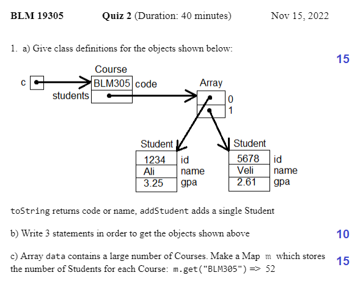
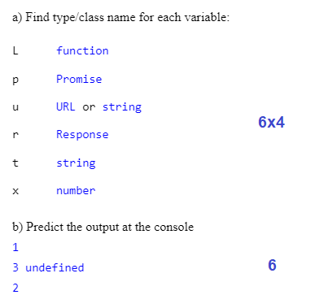
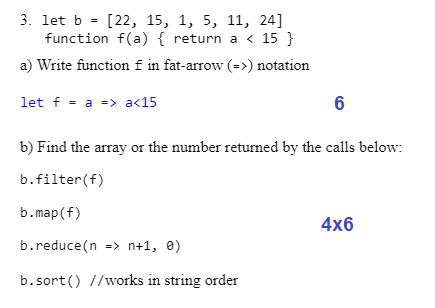


## Quiz#2 -- 2022

<b>Soruların ağırlıkları:</b><br>
1. 15+10+15 = 40<br>
2. 6x4+6 = 30<br>
3. 5x6 = 30


```javascript
class Course {
    constructor(code) {
        this.code = code; this.students = []
    }
    addStudent(s) { this.students.push(s) }
    toString() { return this.code }
}
class Student {
    constructor(id, name, gpa) {
        this.id = id; this.name = name; this.gpa = gpa
    }
    toString() { return this.name }
}
 
c = new Course('BLM305')
c.addStudent(new Student(1234, "Ali", 3.25))
c.addStudent(new Student(5678, "Veli", 2.61))

let m = new Map
data.forEach(c => m.set(c.code, c.students.length))
```

2.  Consider the statements below:
```javascript
let u = 'https://api.github.com'
let L = console.log; var x //x is global
let p = fetch(u); L(1) //u is a valid web address
p.then(r => r.text()).then(t => {x=t.length; L(2)})
L(3, x)
```




```javascript
//You should try this using Dev Tools:
b = [22, 15, 1, 5, 11, 24]
f = a => a<15
L(b.filter(f), b.map(f))
L(b.reduce(n => n+1, 0), b.sort())
```

<script src="../navbar.js"></script>
<style>
  body { 
    max-width: 640px; 
  }
  #navbar {
    margin-left: 0;
  }
</style>
