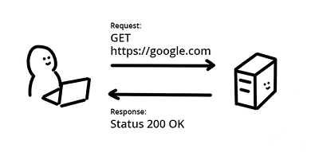
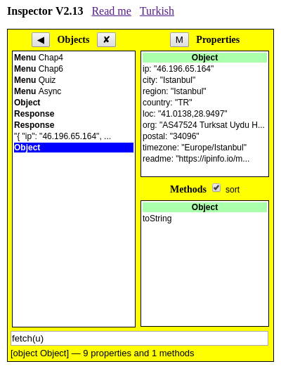

## Reading Files

### Remote Text/JSON

JavaScript ile dosya okumak, 2016 öncesinde zor bir iş sayılırdı, fetch API ile işler kolaylaştı:
```
u = 'https://ipinfo.io/json'
fetch(u).then(r => r.json()).then(display)
fetch(u).then(r => r.text()).then(console.log)
```
fetch() ile gelen Response üstünde sıra ile iki metodu çağırıyoruz. JSON nesnesi Inspector'da, düz metin (String) Console'da izleniyor.

Aynı işi Inspector'da yapmak daha da kolay:
```
fetch(u) ⇒ (input kutusuna yazılacak)
_.clone() ⇒ Response kopyası
_.text() ⇒ text olarak oku
_.json() ⇒ object olarak oku
```


fetch() ile gelen Response nesnesini kopyalayıp birinin text(), diğerinin json() metodunu çağırınca sonuçlar aynı yerde görünüyor.



### Remote Image

Explained [here](Local_files.md)


<script src="/2022/navbar.js"></script>
<style>
  body { 
    max-width: 600px; 
    background: #cef;
  }
  #navbar {
    margin-left: 0;
  }
</style>
